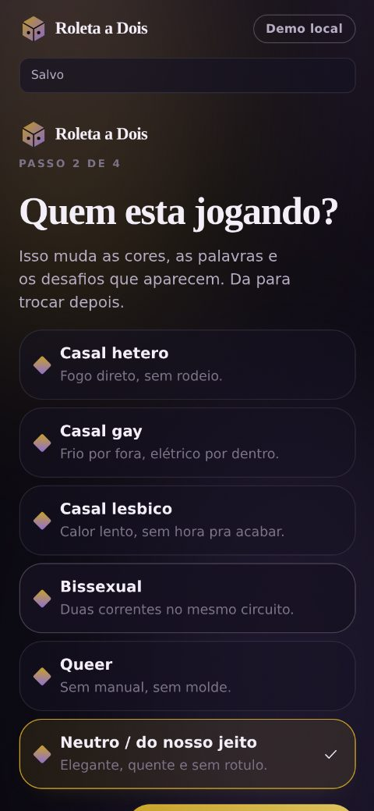
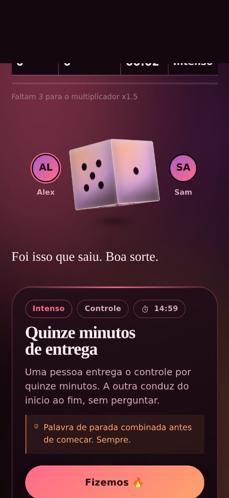
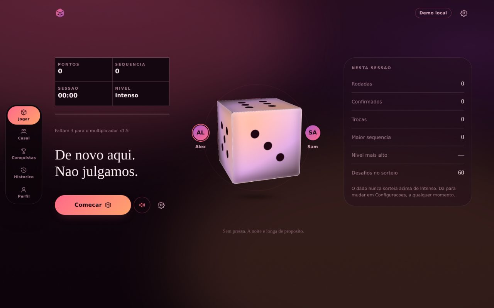
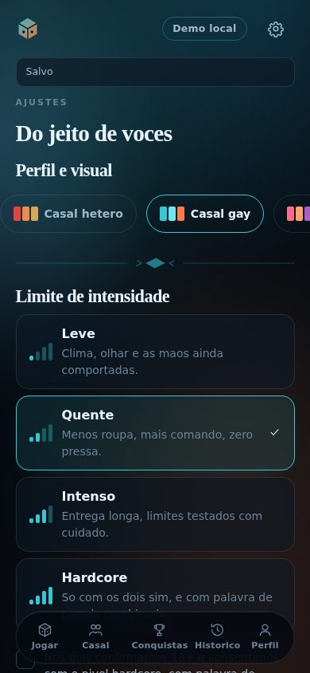
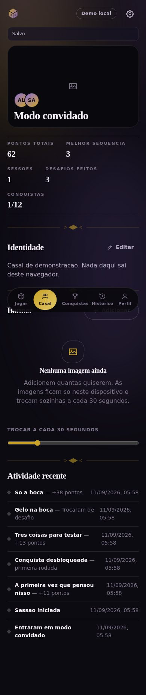

# Roleta a Dois

> **Conteúdo adulto — 18+.** Jogo de sorteio para casais que consentem. Não use nem compartilhe com menores de idade.

Um jogo de dado para dois adultos: toque no dado, ele sorteia um desafio ou posição, vocês fazem (ou trocam). Pontos sobem, sequências multiplicam, conquistas aparecem. A interface muda de identidade conforme o perfil do casal — paleta, ilustração, microtextos e recorte de conteúdo.

Roda **100% no navegador** no modo demo: sem servidor, sem banco, sem cadastro. E já vem com a arquitetura pronta para virar produto com backend.

---

## Sumário

1. [Descrição](#descrição) · 2. [Screenshots](#screenshots) · 3. [Funcionalidades](#funcionalidades)
4. [Arquitetura](#arquitetura) · 5. [Tecnologias](#tecnologias) · 6. [Requisitos](#requisitos)
7. [Instalação](#instalação) · 8. [Desenvolvimento](#desenvolvimento) · 9. [Build](#build)
10. [Variáveis de ambiente](#variáveis-de-ambiente) · 11. [Banco de dados](#banco-de-dados)
12. [Autenticação](#autenticação) · 13. [Modo demo](#modo-demo-local) · 14. [Ativar/desativar o modo sem servidor](#ativar-e-desativar-o-modo-sem-servidor)
15. [Adicionar desafios](#adicionar-desafios) · 16. [Adicionar temas](#adicionar-temas) · 17. [Adicionar banners](#adicionar-banners)
18. [Estrutura de pastas](#estrutura-de-pastas) · 19. [Scripts](#scripts) · 20. [Testes](#testes)
21. [Deploy](#deploy) · 22. [Segurança](#segurança) · 23. [Privacidade](#privacidade)
24. [Acessibilidade](#acessibilidade) · 25. [Troubleshooting](#troubleshooting) · 26. [Roadmap](#roadmap)
27. [Decisões técnicas](#decisões-técnicas) · 28. [Removendo o modo demo](#removendo-o-modo-demo) · 29. [Licença](#licença)

---

## Descrição

O casal escolhe o perfil (hétero, gay, lésbico, bi, queer ou neutro) e o limite de intensidade (Leve, Quente, Intenso, Hardcore). A partir daí o dado sorteia apenas o que cabe nessa faixa. Cada resultado tem título, descrição, nível, categoria, duração sugerida e pontuação.

Depois do sorteio existem exatamente duas saídas:

- **Fizemos 🔥** — pontua, aumenta a sequência e pode desbloquear conquista.
- **Desistir e tentar outro** — troca o desafio, custa 5 pontos e **não quebra a sequência**. Trocar é parte do jogo, não punição.

O produto assume adultos que consentem, com palavra de parada combinada. O nível Hardcore só é liberado depois de uma confirmação explícita dos dois.

---

## Screenshots

| Porta 18+ | Perfil do casal | Jogo (mobile) |
|---|---|---|
|  |  |  |

| Jogo (desktop 1440px) | Outro tema | Perfil do casal |
|---|---|---|
|  |  |  |

---

## Funcionalidades

**Jogo**
- Dado de seis faces em 2.5D (CSS 3D transforms, sem WebGL): sobe, gira, desacelera, cai e quica.
- Sorteio com memória curta — evita repetir os 8 últimos desafios.
- Pontuação com base do nível, multiplicador de sequência (x1 → x1,5 → x2 → x3), bônus por cumprir a duração e desconto por repetição.
- Cronômetro por desafio (opcional) e cronômetro de sessão.
- Detector de inatividade com contador visível (`Sem ação há 04:32`) que pausa quando a aba perde o foco.
- Mensagens dinâmicas por evento (sorteou, confirmou, desistiu, sequência, recorde, sessão longa, retorno…), com variações por perfil de casal.
- 12 conquistas, resumo de sessão e histórico de rodadas.

**Casal e perfis**
- Duas contas separadas, com e-mail e senha individuais, vinculadas ao mesmo perfil de casal.
- Login, logout, troca de conta no mesmo dispositivo, troca de senha, redefinição com confirmação da outra pessoa, desvincular parceiro, apagar tudo.
- Avatar, nome de exibição, @usuário, apelido e bio por pessoa.
- Nome do casal, descrição, "juntos desde", banner e histórico de atividades.

**Banner / carrossel**
- Quantas imagens quiserem, com upload, reordenação, ativar/desativar e remoção.
- Troca automática a cada 30 segundos (ajustável de 5s a 120s), swipe no mobile, setas discretas no desktop, indicadores, lazy loading e crop por `object-fit: cover`.

**Interface**
- 6 temas completos — cada um muda paleta, campo de fundo, textura, glow, raio de canto, inclinação dos ornamentos, peso tipográfico e vocabulário.
- Ícones autorais em SVG (28 ícones na mesma grade). Emoji só dentro de texto, nunca como elemento estrutural.
- Composição editorial: faixas, trilhos horizontais, painéis, divisórias e tipografia grande — sem grid de cards.
- Mobile-first (360/390/412/430px) e composição própria de desktop em 1100/1440/1800px.
- Estados de carregando, vazio, erro, offline, salvando, salvo e falha de gravação.
- `prefers-reduced-motion` respeitado, com override manual nas configurações.

---

## Arquitetura

```
Componentes (features/*)
        │  leem e escrevem pelo contexto
        ▼
   app/store.tsx         ← estado persistido + reducer
        │  grava com debounce de 400ms
        ▼
services/storage/index.ts ← escolhe a implementação
        ├─ LocalStorageAdapter   (MODO_DEMO_LOCAL=true)
        └─ ApiStorageAdapter     (MODO_DEMO_LOCAL=false)
```

Nenhum componente fala com `localStorage` ou `fetch` diretamente. Trocar o modo demo por um backend real é trocar a implementação registrada em `services/storage/index.ts` — a interface `StorageAdapter` continua a mesma.

A lógica do jogo é separada da apresentação: `features/game/scoring.ts` e `features/game/achievements.ts` são funções puras, sem React, cobertas por testes.

Detalhes completos, incluindo o contrato de rotas do backend: [`docs/ARCHITECTURE.md`](docs/ARCHITECTURE.md).

---

## Tecnologias

| Camada | Escolha | Por quê |
|---|---|---|
| Build | Vite 5 | Dev server rápido, build enxuto, sem configuração |
| UI | React 18 + TypeScript (strict) | Tipagem forte no domínio, sem surpresa em refactor |
| Estado | Context + `useReducer` | O app tem um só estado persistido; uma lib de estado seria peso sem ganho |
| Estilo | CSS puro com custom properties | Temas trocam em uma linha; sem runtime de CSS-in-JS |
| Roteamento | Hash router próprio (30 linhas) | 8 telas privadas, nenhuma URL compartilhável |
| Áudio | Web Audio sintetizado | Zero arquivo de som no bundle |
| Testes | Vitest + jsdom | Mesma toolchain do Vite |

**Dependências de produção: apenas `react` e `react-dom`.**

---

## Requisitos

- Node.js **18+** (testado em 22.x)
- npm 9+
- Navegador com suporte a CSS `color-mix()` e 3D transforms: Chrome/Edge 111+, Firefox 113+, Safari 16.4+

---

## Instalação

```bash
git clone https://github.com/AnderHonorato/Roleta-a-Dois-.git
cd Roleta-a-Dois-
npm install
cp .env.example .env
```

O `.env.example` já vem com `VITE_MODO_DEMO_LOCAL=true`, então funciona sem mais nada.

---

## Desenvolvimento

```bash
npm run dev        # http://localhost:5173
npm run typecheck  # tsc --noEmit
npm run test       # suíte completa
```

---

## Build

```bash
npm run build      # typecheck + build de produção em dist/
npm run preview    # serve o dist/ em http://localhost:4173
```

Saída atual: **~268 kB de JS** e **~42 kB de CSS** (sem gzip), em 83 módulos.

---

## Variáveis de ambiente

Todas ficam em `.env` (nunca commitado). O modelo está em `.env.example`.

| Variável | Padrão | O que faz |
|---|---|---|
| `VITE_MODO_DEMO_LOCAL` | `true` | `true` = roda sem servidor, salvando no navegador. `false` = exige `VITE_API_URL` |
| `VITE_APP_NAME` | `Roleta a Dois` | Nome exibido no produto |
| `VITE_API_URL` | vazio | URL base da API. Ignorada no modo demo |
| `VITE_MAX_UPLOAD_MB` | `4` | Tamanho máximo de imagem no upload |

> ⚠️ Tudo que começa com `VITE_` **vai para o bundle e é público**. Segredos de backend (`DATABASE_URL`, `SESSION_SECRET`, `PASSWORD_PEPPER`) **nunca** levam esse prefixo.

---

## Banco de dados

No modo demo não existe banco. Para produção, o modelo mínimo está implementado em `src/types/index.ts` e descrito em [`docs/ARCHITECTURE.md`](docs/ARCHITECTURE.md):

`User` · `Couple` · `CoupleMember` · `GameSession` · `GameRound` · `Challenge` · `Achievement`

Recomendação: **PostgreSQL** (direto ou via Supabase). O catálogo de desafios pode continuar em arquivo (`src/data/challenges/`) até que exista painel administrativo — a forma dos dados é a mesma nos dois casos.

---

## Autenticação

**Modo demo (cliente).** As duas contas ficam no navegador. As senhas passam por **PBKDF2-SHA256, 150.000 iterações, salt de 16 bytes por usuário** (`src/lib/crypto.ts`) antes de serem gravadas. Nenhuma senha em texto puro — nem nos dados de exemplo. A comparação de hash é em tempo constante e o login devolve a mesma mensagem para "usuário não existe" e "senha errada".

**Produção.** As mesmas funções de `src/services/auth/` viram chamadas ao backend, que faz o hashing (argon2id ou bcrypt), aplica rate limiting e emite cookie de sessão `HttpOnly` + `SameSite=Lax` + `Secure`. O `ApiStorageAdapter` já envia `credentials: 'include'` e o header `X-CSRF-Token`.

**Recuperação de senha.** No demo, a outra pessoa do casal autoriza com a senha dela — o que também implementa a regra de "mudanças sensíveis precisam dos dois". Em produção isso vira token de uso único por e-mail.

---

## Modo demo local

Ligado por padrão. Nesse modo:

- não há servidor, banco nem rede;
- um casal de exemplo é criado (Alex e Sam);
- todo o progresso vai para o `localStorage`;
- o fluxo completo funciona: onboarding, sorteio, pontuação, sequência, conquistas, perfis, banner, histórico e configurações.

Contas de exemplo: usuário `um` ou `dois`, senha `demo1234`.

Todo o código exclusivo do demo está isolado em:

- `src/services/demoSeed.ts` — o casal mockado
- `src/services/storage/localAdapter.ts` — a persistência local
- a bifurcação em `src/services/storage/index.ts`
- a flag em `src/services/config.ts`

---

## Ativar e desativar o modo sem servidor

**Ativar (padrão):**

```bash
# .env
VITE_MODO_DEMO_LOCAL=true
```

**Desativar (usar backend):**

```bash
# .env
VITE_MODO_DEMO_LOCAL=false
VITE_API_URL=https://api.seudominio.com
```

Reinicie o dev server depois de mudar o `.env` — o Vite lê as variáveis no boot.

Com o modo demo desligado e sem backend no ar, o app mostra a tela de erro de armazenamento com o motivo exato, em vez de fingir que salvou.

---

## Adicionar desafios

Cada nível tem seu arquivo. Adicionar conteúdo é sempre um *append*, nunca uma edição de componente.

1. Abra `src/data/challenges/<nivel>.ts` (`leve`, `quente`, `intenso` ou `hardcore`).
2. Acrescente um objeto ao array:

```ts
{
  id: 'qt-nome-unico',          // precisa ser único no catálogo inteiro
  audience: ['neutral'],        // 'neutral' vale para todos os perfis
  level: 'quente',
  category: 'toque',            // aquecimento|toque|palavras|posicao|jogo|controle|surpresa
  title: 'Título curto',
  description: 'O que fazer, em uma ou duas frases.',
  hint: 'Linha de apoio ou aviso de segurança.',  // opcional
  durationSec: 180,             // 0 = sem cronômetro
  score: 24,
  tags: ['toque', 'provocacao'],
  active: true,                 // false tira do sorteio sem apagar
},
```

3. `npm run test` — a suíte verifica ids duplicados, campos obrigatórios e se cada perfil continua tendo conteúdo suficiente.

Para criar uma categoria nova, acrescente-a em `Category` (`src/types/index.ts`) e no mapa `CATEGORIES` (`src/data/challenges/index.ts`).

---

## Adicionar temas

1. Em `src/styles/themes.css`, copie um bloco `[data-theme='...']` e ajuste os tokens. Um tema bom muda mais que cor — mexa também em `--field`, `--grain-opacity`, `--motif-skew`, `--motif-radius` e `--display-weight`.
2. Acrescente o id ao tipo `Audience` em `src/types/index.ts`.
3. Registre o perfil em `src/data/audiences.ts` (rótulo, tagline, assinatura).
4. Opcional: microtextos próprios em `byAudience` (`src/data/messages/index.ts`).

O tema é aplicado como `data-theme` no `<html>`, então qualquer componente responde sem precisar de prop.

---

## Adicionar banners

Pela interface: **Casal → Banner → Adicionar**. Aceita JPG, PNG, WebP e AVIF até o limite de `VITE_MAX_UPLOAD_MB`. As imagens são validadas (MIME + extensão + decodificação real), redimensionadas para no máximo 1280px e guardadas como data URL.

Cada imagem tem texto alternativo, ordem e liga/desliga. O intervalo de troca (padrão 30s) fica no mesmo lugar.

> No modo demo o `localStorage` tem cota de ~5MB. Se encher, o app avisa explicitamente e sugere remover imagens — não falha em silêncio.

---

## Estrutura de pastas

```
src/
  app/                     App, store, roteador, splash
  components/              Avatar, Sheet, estados de interface
  design-system/
    icons/Icons.tsx        28 ícones autorais em SVG
    svg/Wordmark.tsx       marca e ornamentos
  features/
    onboarding/            porta 18+, perfil, nível, entrada
    auth/                  cadastro do casal e login
    game/                  GameProvider, GameScreen, scoring, achievements
    roulette/              Die.tsx + die.css (dado 2.5D)
    couple/                perfil do casal, banner, atividade
    profile/               perfil individual
    achievements/          conquistas
    session/               histórico
    settings/              configurações e privacidade
    carousel/              Carousel.tsx
  data/
    challenges/            catálogo por nível
    messages/              banco de microtextos
    audiences.ts           perfis de casal
    achievements.ts        definição das conquistas
  services/
    storage/               StorageAdapter + Local + API
    auth/                  cadastro, login, senha
    config.ts              flags de ambiente
    demoSeed.ts            casal mockado (só demo)
  hooks/                   inatividade, cronômetros, som, movimento
  lib/                     crypto, image, sanitize, rng, format, id
  styles/                  reset, tokens, themes, base, app
  types/                   contratos de domínio
tests/                     63 testes (Vitest)
docs/                      arquitetura, privacidade, screenshots
```

---

## Scripts

| Script | O que faz |
|---|---|
| `npm run dev` | Dev server com HMR |
| `npm run build` | Typecheck + build de produção |
| `npm run preview` | Serve o `dist/` |
| `npm run typecheck` | `tsc --noEmit` |
| `npm run test` | Roda a suíte uma vez |
| `npm run test:watch` | Suíte em watch |

---

## Testes

**63 testes automatizados**, em 5 arquivos:

- `scoring.test.ts` — multiplicadores, bônus de tempo, penalidade de repetição, piso de 1 ponto, penalidade de troca.
- `challenges.test.ts` — ids únicos, integridade dos campos, teto de nível, exclusão de categoria, cobertura por perfil.
- `core.test.ts` — mensagens sem repetição, sorteio com memória, formatação, saneamento, validação de senha, regras de conquista.
- `auth.test.ts` — PBKDF2, salts distintos, verificação, login genérico, troca e redefinição de senha.
- `storage.test.ts` — gravação, leitura, estado corrompido, migração de versão, limpeza.

**Verificação manual em navegador** (Chromium via Playwright), já executada nesta entrega:

| Verificação | Resultado |
|---|---|
| Onboarding completo (4 telas) | ✅ |
| Hardcore bloqueado sem consentimento | ✅ |
| Sorteio, revelação, "Fizemos 🔥" e pontuação | ✅ |
| "Desistir e tentar outro" troca sem quebrar a sequência | ✅ |
| Contabilidade (4 rodadas → 3 feitas, 1 trocada, sequência 3) | ✅ |
| Persistência após reload, sem senha em texto puro | ✅ |
| Cadastro de duas contas, login, senha errada recusada, logout | ✅ |
| Carrossel: autoplay, setas, teclado, swipe, autoplay desligado | ✅ |
| Troca de tema em tempo real | ✅ |
| Mobile 360/390px sem scroll horizontal | ✅ |
| Desktop 1440 e 1920 com composição própria | ✅ |
| `prefers-reduced-motion` (resultado sem animação) | ✅ |
| Skip-link no primeiro Tab, foco visível | ✅ |
| Nomes acessíveis, labels e alvos de toque em 7 rotas | ✅ |
| Erros de console | nenhum |

Contraste medido (WCAG AA exige 4,5:1 para texto normal):

| Tema | Texto principal | Secundário | Terciário | Destaque |
|---|---|---|---|---|
| neutral | 17,12 | 9,12 | 5,71 | 8,08 |
| gay | 17,56 | 9,51 | 6,45 | 9,65 |
| lesbian | 17,78 | 9,55 | 6,67 | 7,22 |
| hetero | 17,93 | 9,15 | 6,41 | 4,81 |
| bi | 17,12 | 8,72 | 5,83 | 4,99 |
| queer | 18,38 | 10,43 | 7,09 | 10,29 |

**Não testado:** Safari, Firefox e dispositivos físicos (Android/iPhone) — o ambiente desta entrega só tem Chromium. A responsividade foi verificada por viewport emulado, não em aparelho real.

---

## Deploy

O build é estático. Qualquer host de arquivos serve:

```bash
npm run build
# publique o conteúdo de dist/
```

**Vercel / Netlify / Cloudflare Pages:** build `npm run build`, diretório `dist`. Configure as variáveis `VITE_*` no painel do serviço.

**Nginx:** aponte a raiz para `dist/`. Como o roteamento é por hash, não é preciso fallback de SPA.

Cabeçalhos recomendados em produção:

```
Content-Security-Policy: default-src 'self'; img-src 'self' data:; style-src 'self' 'unsafe-inline' https://fonts.googleapis.com; font-src https://fonts.gstatic.com; connect-src 'self'
Referrer-Policy: no-referrer
X-Content-Type-Options: nosniff
X-Frame-Options: DENY
Strict-Transport-Security: max-age=31536000; includeSubDomains
```

---

## Segurança

Implementado:

- Senhas derivadas com PBKDF2-SHA256 (150k iterações, salt por usuário). Nunca em texto puro.
- Comparação de hash em tempo constante; login com mensagem genérica e custo artificial quando o usuário não existe.
- Saneamento de toda entrada livre (remoção de caracteres de controle e zero-width, limite de tamanho) antes de persistir.
- Validação de upload: MIME permitido, extensão, tamanho máximo e decodificação real da imagem.
- Nomes de arquivo normalizados (`safeFileName`) contra *path traversal*.
- Sem `dangerouslySetInnerHTML`, sem `eval`, sem injeção de HTML em nenhum ponto — o React escapa todo texto.
- Segredos só em `.env`, com `.env.example` versionado e `.env` no `.gitignore`.
- `noindex, nofollow` e `Referrer-Policy: no-referrer` no HTML.
- Zero dependências de runtime além de React — superfície de supply chain mínima.

Pendente para produção (depende do backend):

- Rate limiting de login e de redefinição de senha.
- Cookie de sessão `HttpOnly` + rotação de token CSRF (o cliente já envia o header).
- Hashing server-side com argon2id e pepper fora do banco.

---

## Privacidade

O produto **não** usa câmera, microfone, localização, analytics, pixels de rastreio ou scripts de terceiros. Não há requisição para domínio externo além da fonte tipográfica (Google Fonts) — e a página degrada corretamente se ela não carregar.

No modo demo, **nada sai do navegador**. Política completa: [`docs/PRIVACY.md`](docs/PRIVACY.md), também acessível dentro do app em Configurações → Privacidade.

---

## Acessibilidade

- Contraste AA em todos os 6 temas, inclusive texto terciário (tabela acima).
- Navegação completa por teclado, skip-link e `:focus-visible` em todos os elementos interativos.
- `aria-label` em todo controle sem texto; `role="switch"`, `role="radio"` e `role="tab"` com estado correto.
- Alvos de toque de no mínimo 44px de altura.
- Estado nunca comunicado só por cor (há ícone, texto ou posição junto).
- `prefers-reduced-motion` respeitado, com override manual em Configurações.
- Dado com `role="status"` anunciando "rolando" e a face final.

---

## Troubleshooting

**A página abre em branco.** Verifique o console. Causa mais comum: navegador antigo sem `color-mix()` ou 3D transforms. Requisitos mínimos acima.

**"O armazenamento local encheu."** As imagens do banner ocupam a maior parte da cota de ~5MB do `localStorage`. Remova imagens em Casal → Banner.

**"Armazenamento bloqueado (janela anônima ou cookies desativados)."** Alguns navegadores bloqueiam `localStorage` em modo anônimo. Use uma janela normal ou libere os dados do site.

**O progresso sumiu.** No modo demo, limpar os dados do site apaga tudo — não há backup nem servidor. É o comportamento esperado.

**O som não toca.** Navegadores só liberam áudio após um gesto do usuário. Toque em qualquer lugar e tente de novo; confira também o volume em Configurações.

**O dado não anima.** Ou `prefers-reduced-motion` está ativo no sistema, ou o modo "Reduzir movimento" está ligado em Configurações → Som e movimento.

**A fonte parece diferente.** Sem acesso ao Google Fonts, o app cai no fallback (Georgia / system-ui). Continua legível e proporcional.

**Mudei o `.env` e nada aconteceu.** Reinicie o dev server; o Vite lê as variáveis no boot.

---

## Roadmap

- [ ] Backend real (PostgreSQL + API) e migração do `LocalStorageAdapter`
- [ ] Painel administrativo de desafios (as estruturas já suportam: `active`, `score`, `audience`, `level`)
- [ ] Sincronização entre os dois dispositivos do casal em tempo real
- [ ] PWA com instalação e funcionamento offline
- [ ] Exportar/importar os dados do casal
- [ ] Mais conteúdo por perfil, reduzindo a dependência de itens neutros
- [ ] Testes end-to-end no CI e verificação em Safari/Firefox

---

## Decisões técnicas

**Por que hash router em vez de React Router.** Oito telas privadas, nenhuma URL para compartilhar. 30 linhas resolvem e economizam uma dependência.

**Por que CSS puro com custom properties.** Trocar tema fica sendo trocar um atributo no `<html>`; nenhum componente precisa saber qual tema está ativo. Também elimina o runtime de CSS-in-JS do bundle.

**Por que CSS 3D e não WebGL/Three.js.** O dado precisa de volume, não de uma cena. `transform-style: preserve-3d` dá aresta, sombra e perspectiva reais com algumas `div`s, composto na GPU, e degrada sozinho com `prefers-reduced-motion`. Uma engine 3D custaria centenas de kB para o mesmo resultado visual.

**Por que hashear senha no cliente no modo demo.** Não substitui hashing de servidor — e o código diz isso. Mas garante que nem os dados de exemplo tenham senha legível em `localStorage`, e mantém o mesmo contrato de funções que o backend vai implementar.

**Por que som sintetizado.** Cinco efeitos por osciladores custam zero byte de bundle e nenhuma requisição. O `AudioContext` só nasce no primeiro gesto, então nada toca sozinho.

**Por que trocar de desafio não quebra a sequência.** Punir a troca empurraria o casal a fazer o que não quer. O custo é simbólico (5 pontos) e a provocação é textual.

**Por que a lógica de jogo é pura.** `scoring.ts` e `achievements.ts` não importam React. Dá para testar a regra sem montar componente — e mudar a regra sem mexer em tela.

---

## Removendo o modo demo

Quando o backend estiver no ar, o demo sai em quatro passos:

1. `.env`: `VITE_MODO_DEMO_LOCAL=false` e `VITE_API_URL=https://...`
2. Apague `src/services/demoSeed.ts` e as importações de `DEMO_CREDENTIALS` em `SettingsScreen.tsx` e do bloco "Modo convidado" em `Onboarding.tsx`.
3. Em `src/services/storage/index.ts`, remova o ramo `MODO_DEMO_LOCAL ? new LocalStorageAdapter() : ...` e deixe apenas `new ApiStorageAdapter()`. Apague `localAdapter.ts` e `tests/storage.test.ts`.
4. Em `src/services/config.ts`, remova `MODO_DEMO_LOCAL`, `STORAGE_KEY` e `SHOW_DEMO_BADGE`.

Nada mais no app depende do modo demo — a interface `StorageAdapter` isola o resto.

---

## Licença

Ainda não definida. Enquanto isso, todos os direitos reservados a [@AnderHonorato](https://github.com/AnderHonorato).

---

**Aviso final.** Este projeto trata de sexualidade adulta e consensual. Não contém, e não deve receber, conteúdo envolvendo menores, violência real, coerção ou pessoas incapazes de consentir. Se você tem menos de 18 anos, feche a página.
